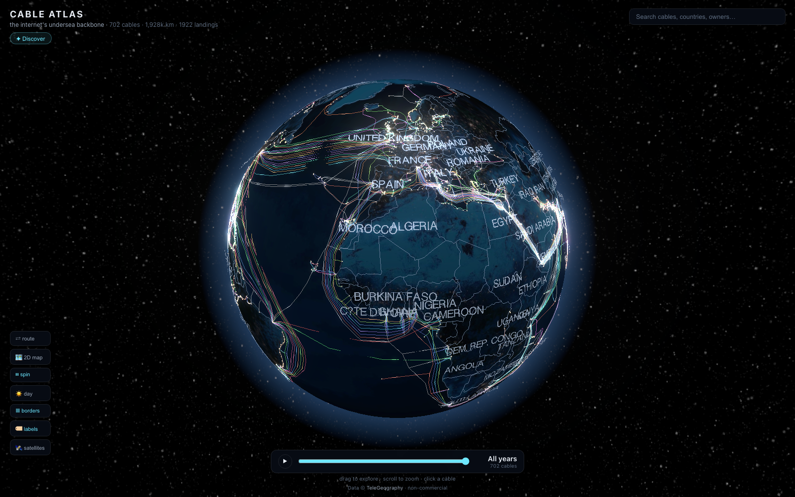
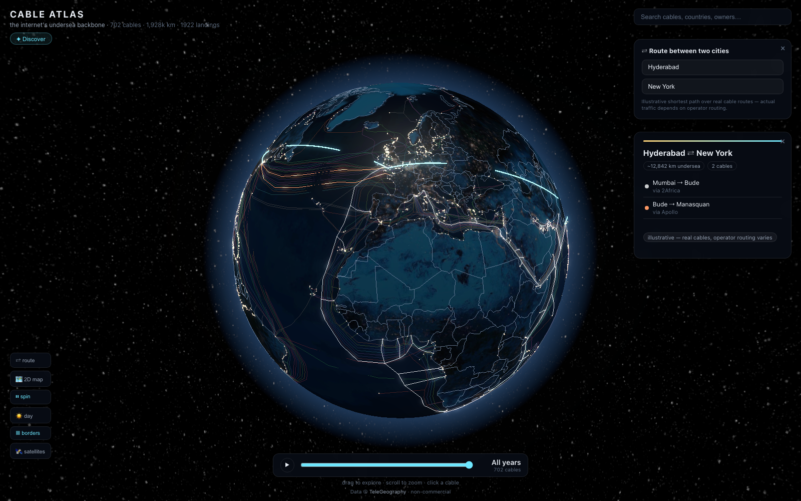
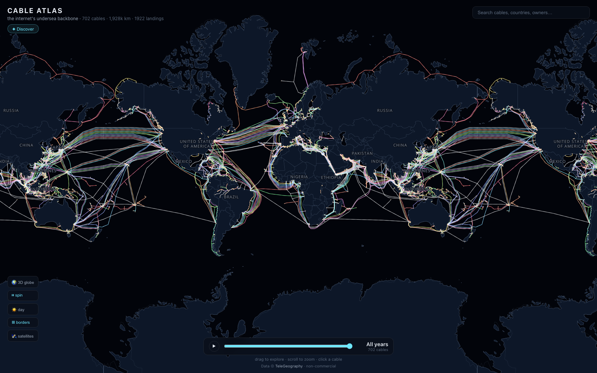
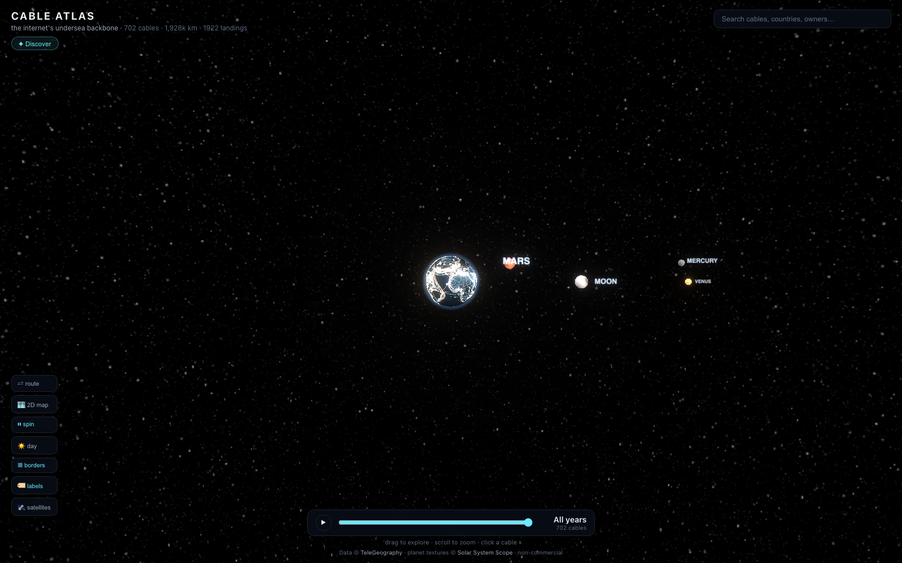

# Cable Atlas 🌐

**An interactive 3D atlas of the internet's physical infrastructure — every
submarine cable on Earth, live satellites, and city-to-city routing, on a
cinematic globe.**

**Live demo → [cable-globe.vercel.app](https://cable-globe.vercel.app)**



## Features

- **702 real submarine cables** with actual routed geometry, official colors,
  owners, lengths and ready-for-service years — TeleGeography's public data,
  baked to static JSON at build time
- **Animated traffic pulses** flowing along every cable (one merged WebGL draw
  call + one shader for all cables — 60 fps)
- **Click anything**: cables fly the camera in and open a detail panel; landing
  stations list every cable that lands there; satellites show orbit + info
- **Timeline 1989 → 2029**: scrub or play to watch the internet wire itself
  around the planet — satellites appear by launch year too
- **City-to-city routing**: pick two cities, get the shortest path over the
  real cable graph with animated arcs and per-leg cable listing
  
- **Narrated guided tour** (~3 min, browser speech synthesis) — transatlantic
  corridor, the Suez chokepoint, 2Africa, Big Tech's cables, Tonga's single
  thread, and the growth timeline
- **Search** cables, countries (first-class results highlighting a whole
  country's connectivity), owners, landing points — press `/`
- **Discover drawer**: chokepoints, busiest hubs, longest cables, Big Tech
- **3D ↔ 2D toggle**: full MapLibre dark map with the same cables, pulses,
  selection sync and labels — no external tile service, fully self-contained
  
- **143+ real satellites** (ISS, Starlink, OneWeb, GPS, geostationary) at
  true current positions from CelesTrak elements, with ground-station beams
- **Zoom out to the solar system**: Sun, Moon (correct current phase) and
  planets in their real directions today, NASA-imagery textures
  

## Quick start

```bash
git clone https://github.com/saiudayagiri/cable-globe
cd cable-globe
npm install
npm run vendor   # copy maplibre worker into public/ (once, and after upgrades)
npm run dev      # http://localhost:5173
```

Refresh the datasets (all optional — baked data is committed):

```bash
npm run data                       # cables + landing points (TeleGeography API)
node scripts/fetch-borders.mjs     # country borders (Natural Earth)
node scripts/fetch-2d.mjs          # land polygons, place labels, font glyphs
node scripts/fetch-satellites.mjs  # satellite elements (CelesTrak)
```

## Architecture notes

- **One draw call for all cables**: merged `THREE.LineSegments`; a single
  shader drives pulses (per-vertex arc-distance phase), timeline filtering
  (per-vertex year + uniform), hover and selection dimming (attribute fills).
  Scrubbing the timeline costs one uniform write.
- **Routing** is Dijkstra over a graph where stations on the same cable are
  connected, with penalized overland links bridging nearby stations and
  inland cities. Labeled illustrative — real traffic depends on operators.
- **Satellites** are propagated with Keplerian elements from their epoch plus
  GMST alignment, so geostationary birds hover over their true longitudes.
- **2D map** is MapLibre with zero external services: land/borders/labels are
  baked GeoJSON, glyphs vendored, cables share the 3D selection state.
- The site is **fully static** — no backend, no API keys, visitors never hit
  the upstream data providers.

## Deploy

**Vercel**: `vercel deploy --prod` (that's what runs the live demo).

**Docker / Kubernetes / Rancher** — image at `ghcr.io/saiudayagiri/cable-atlas`:

```bash
docker build -t ghcr.io/saiudayagiri/cable-atlas:v1 .
docker push ghcr.io/saiudayagiri/cable-atlas:v1

kubectl create namespace cable-atlas
kubectl apply -n cable-atlas -f deploy/k8s.yaml   # edit Ingress host first
kubectl -n cable-atlas get pods -w                # wait for 2/2 Running

# no DNS yet? check it via:
kubectl -n cable-atlas port-forward svc/cable-atlas 8080:80
```

If the ghcr package is private, either make it public (GitHub → Packages →
cable-atlas → settings) or create a pull secret and uncomment
`imagePullSecrets` in [deploy/k8s.yaml](deploy/k8s.yaml):

```bash
kubectl -n cable-atlas create secret docker-registry ghcr-pull \
  --docker-server=ghcr.io --docker-username=<you> \
  --docker-password=<token-with-read:packages>
```

The container is a ~15 MB nginx serving static files. No server-side GPU —
all rendering is the visitor's WebGL. Two tiny replicas (25m CPU / 32Mi each)
handle thousands of concurrent visitors.

## Data & licenses

Code is [MIT](LICENSE). Bundled data is not:

| Source | What | License |
|---|---|---|
| [TeleGeography](https://www.submarinecablemap.com) | cables, landing points | © TeleGeography, non-commercial w/ attribution |
| [Natural Earth](https://www.naturalearthdata.com) | borders, land, places | public domain |
| [CelesTrak](https://celestrak.org) | satellite elements | public |
| [Solar System Scope](https://www.solarsystemscope.com/textures/) | planet textures | CC BY 4.0 |

This is a fan visualization, not affiliated with TeleGeography.

## Contributing

See [CONTRIBUTING.md](CONTRIBUTING.md). Issues and PRs welcome — good first
targets: more tour stops, mobile polish, accessibility, new Discover lists.
